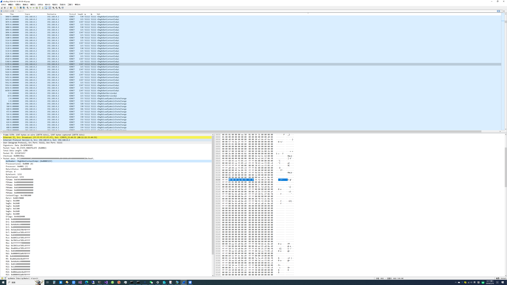

#### 使用说明

把目录下文件复制到如下位置,Wireshark支持版本4.0以上

C:\Program Files\Wireshark\plugins\4.0\kdnet.lua

C:\Program Files\Wireshark\gcrypt.dll

C:\Program Files\Wireshark\luagcrypt.dll

启动

"C:\Program Files (x86)\Windows Kits\10\Debuggers\x64\windbg.exe" -k "com:pipe,port=\\.\pipe\pipeout,baud=115200,resets=0,reconnect"

powershell执行,hyper-v模式

Set-VMComPort -VMName win10x6422h2 -Path \\.\pipe\pipein -Number 1

在虚拟机中执行

bcdedit /dbgsettings serial DEBUGPORT:1 BAUDRATE:115200

bcdedit /debug on

最后执行

pipe.exe pipeout pipein

Wireshark在pipe.exe目录下打开生成的pcap文件

原作者工具使用方法

"C:\Program Files (x86)\Windows Kits\10\Debuggers\x64\windbg.exe" -k "net:port=51111,key=8.8.8.8"

在虚拟机中执行

bcdedit /dbgsettings net hostip:192.168.2.1 port:51111 key:8.8.8.8

bcdedit /debug on

最后执行

"C:\Program Files\Wireshark\Wireshark.exe" -Xlua_script:kdnet.lua -okdnet.key:8.8.8.8  -r pcaps/windbg-uncut.pcap

新增Wireshark实时捕获模式使用方法

pipe.exe pipeout pipein bacnet

"C:\Program Files\Wireshark\Wireshark.exe"  -ni \\.\pipe\bacnet

在Wireshark打开pipe\bacnet查看实时捕获数据包

## 运行效果 ##

以下是笔者工具运行的效果,如图:

##  相关引用 ##

[原作者工具](https://github.com/Lekensteyn/kdnet/tree/master)

## 参与贡献 ##

作者来自ZheJiang Guoli Security Technology,邮箱cbwang505@hotmail.com